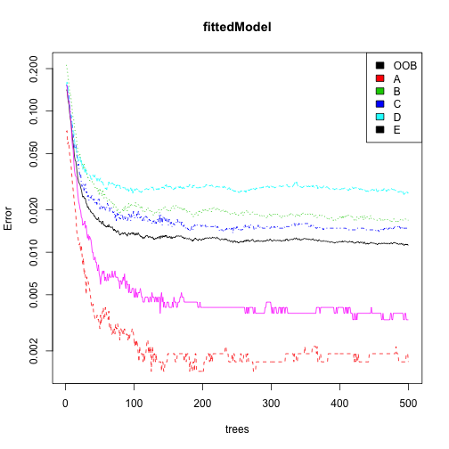
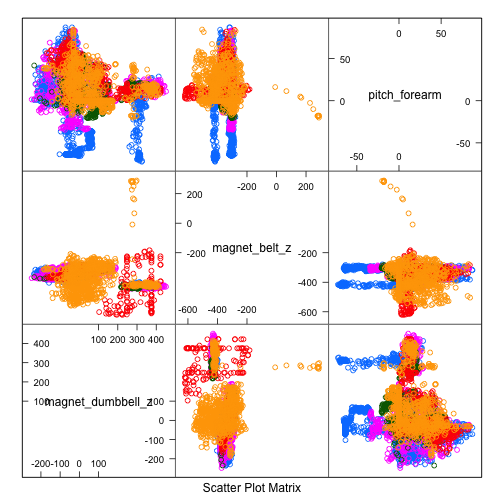

## Executive Summary

In this analysis we will try to predict 20 observations based on data from personal fitness devices. Using the _randomForest_ algorithm on a subset of important predictors (31 of total), we can predict the outcome on a training dataset with about 99% accuracy.

## Exploratory Analysis

The data for our analysis has been partitioned into training and test datasets already. Our first step will be to load the data, and then remove any of observations that are not complete.  We'll also remove the first five datapoints which are not device measurements.


```r
training   = read.csv("pml-training.csv", stringsAsFactors=F)
validation = read.csv("pml-testing.csv", stringsAsFactors=F)
completeCasesByVariables = complete.cases(t(training))
completeCasesByVariables[1:7] = F
training   = training[,completeCasesByVariables]
validation = validation[,completeCasesByVariables]
```


The training set now contains 19622 and 86 variables, but some of these contain no variation or are covarient with other variables, and thus should be removed. Note that we are also removing the variables from the validation set.


```r
nzvVariables = nearZeroVar(training, uniqueCut=10)
training     = training[,-nzvVariables]
validation   = validation[,-nzvVariables]

M = abs(cor(training[,-dim(training)[2]]))
diag(M) = 0
corVariables = findCorrelation(M, .7)
training   = training[,-corVariables]
validation = validation[,-corVariables]
```


The processed training dataset now contains 19622 observations and variables 31 variables. 

## Data Analysis

We'll treat the provided test set as our _validation_ dataset, and partition the provided training data into our own training and test datasets.


```r
inTrain = createDataPartition(y=training$classe, p=.75, list=F)
trainingSet = training[inTrain,]
testingSet  = training[-inTrain,]
```

Next we will train the model using all remaining variables using the _randomForest_ algorithm with the default options, and build a prediction based on our testing dataset.


```r
trainingSet$classe = as.factor(trainingSet$classe)
resultColumn = dim(testingSet)[2]
fittedModel = randomForest(classe ~ ., data = trainingSet)
predictResult = predict(fittedModel, testingSet[,-resultColumn])
modelAccuracy = confusionMatrix(testingSet[,resultColumn], predictResult)
modelAccuracy$overall
```

```
##       Accuracy          Kappa  AccuracyLower  AccuracyUpper   AccuracyNull 
##      0.9885808      0.9855527      0.9851965      0.9913628      0.2860930 
## AccuracyPValue  McnemarPValue 
##      0.0000000            NaN
```

Our model provides a 0.9885808% accuracy, which is pleasantly sufficient, and predicts most variables very well.


```r
correctPredictions = testingSet$classe == predictResult
table(predictResult, testingSet$classe)
```

```
##              
## predictResult    A    B    C    D    E
##             A 1392   11    0    0    0
##             B    3  933   10    0    0
##             C    0    5  838   12    0
##             D    0    0    7  786    2
##             E    0    0    0    6  899
```

Let's have a look at our 5 most important predictors.

```r
variableImportance = varImp(fittedModel)
rownames(variableImportance)[order(variableImportance, decreasing = T)][1:15]
```

```
##  [1] "magnet_dumbbell_z"    "magnet_belt_z"        "pitch_forearm"       
##  [4] "roll_forearm"         "roll_dumbbell"        "gyros_belt_z"        
##  [7] "roll_arm"             "total_accel_dumbbell" "yaw_dumbbell"        
## [10] "gyros_dumbbell_y"     "magnet_forearm_z"     "accel_forearm_x"     
## [13] "magnet_arm_x"         "magnet_belt_x"        "yaw_arm"
```
## Conclusion

In this analysis, we showed that it is possible to predict with the outcome of a testing dataset 0.9885808% accuracy using simple machine learning techniques and the _randomForest_ algorithm. The total execution time of this script was under one minute using 19622 observations and 31 variables, demonstrating the usefulness of this easily applied method.

## Appendix

Plot of must important predictors and their cross-validation importance using the Gini Scale.

```r
varImpPlot(fittedModel, n.var = 10)
```


Plot the error rate over various outcomes and iterations of the tree.

```r
plot(fittedModel, log="y")
legend("topright", colnames(fittedModel$err.rate),col=1:5,fill=1:5)
```



Examine how our top three predictors relate to each other

```r
variableImportance = varImp(fittedModel)
tenMostImportantVariables = rownames(variableImportance)[order(variableImportance, decreasing = T)][1:10]

testingSet$classe = as.factor(testingSet$classe)
featurePlot(x=testingSet[, tenMostImportantVariables[1:3]], y=testingSet$classe, plot="pairs")
```



General information about accuracy, confidence, and error.


```r
modelAccuracy
```

```
## Confusion Matrix and Statistics
## 
##           Reference
## Prediction    A    B    C    D    E
##          A 1392    3    0    0    0
##          B   11  933    5    0    0
##          C    0   10  838    7    0
##          D    0    0   12  786    6
##          E    0    0    0    2  899
## 
## Overall Statistics
##                                           
##                Accuracy : 0.9886          
##                  95% CI : (0.9852, 0.9914)
##     No Information Rate : 0.2861          
##     P-Value [Acc > NIR] : < 2.2e-16       
##                                           
##                   Kappa : 0.9856          
##  Mcnemar's Test P-Value : NA              
## 
## Statistics by Class:
## 
##                      Class: A Class: B Class: C Class: D Class: E
## Sensitivity            0.9922   0.9863   0.9801   0.9887   0.9934
## Specificity            0.9991   0.9960   0.9958   0.9956   0.9995
## Pos Pred Value         0.9978   0.9831   0.9801   0.9776   0.9978
## Neg Pred Value         0.9969   0.9967   0.9958   0.9978   0.9985
## Prevalence             0.2861   0.1929   0.1743   0.1621   0.1845
## Detection Rate         0.2838   0.1903   0.1709   0.1603   0.1833
## Detection Prevalence   0.2845   0.1935   0.1743   0.1639   0.1837
## Balanced Accuracy      0.9957   0.9911   0.9880   0.9921   0.9964
```

## Citations

WLE Dataset: http://groupware.les.inf.puc-rio.br/har

Velloso, E.; Bulling, A.; Gellersen, H.; Ugulino, W.; Fuks, H. Qualitative Activity Recognition of Weight Lifting Exercises. Proceedings of 4th International Conference in Cooperation with SIGCHI (Augmented Human '13) . Stuttgart, Germany: ACM SIGCHI, 2013.
